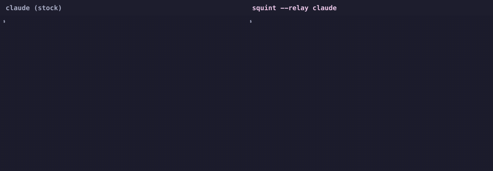

# squint

**眯着眼看 coding agent 干活。** 每次工具调用都收成一行会原地刷新的状态，agent 的回答原样保留。



```bash
brew install --cask mayangzz/tap/squint      # 或者：go install github.com/mayangzz/squint@latest
sq() { squint --relay claude "$@"; }         # 写进 ~/.zshrc，之后用 `sq` 代替 `claude`
```

[English](README.md)

---

## 为什么要用

agent 每一步都在念叨：完整的 shell 命令、一段输出预览、`… +78 lines (ctrl+o to expand)`、`Allowed by auto mode classifier`。你真正想看的是那两句结论，却得先翻过一整屏过程。

squint 把每一步收成一行，原地刷新：

```
🔍 running  go test ./... ×3
📖 reading  internal/relay/filter.go
✏️  editing  service/bill/payload.go
```

抬头扫一眼就知道它在干什么、有没有卡住，不用再读 shell 会话的逐字稿。

**它不改变 agent 的任何行为。** 权限、斜杠命令、Esc 打断、粘贴图片、鼠标选中、滚动回看全都照旧，只换了显示层。不想用了直接不套就行，没有任何东西需要还原。

### 和 Claude Code 自带的显示有什么区别

| | 过程 | 回答 |
|---|---|---|
| 默认视图 | 每次调用都带输出预览 | ✓ |
| focus 类视图 | 全部隐藏 | 只剩最后一条 |
| **squint** | **每步一行、实时刷新** | **全部保留** |

新版 Claude Code 已经会把搜索、读文件归成一行（`Searched for 4 patterns`）。squint 还会把剩下仍然整段打印的东西也收起来，比如带输出预览的 shell 命令、权限提示、编辑记录，并把连续调用同一个工具合并成一个计数。

---

## 安装

| | |
|---|---|
| Homebrew（macOS / Linux） | `brew install --cask mayangzz/tap/squint` |
| 二进制 | 从 [Releases](https://github.com/mayangzz/squint/releases) 下载，把 `squint` 放进 `PATH` |
| Go 1.25+ | `go install github.com/mayangzz/squint@latest` |

## 使用

```bash
# 包一层，原版 claude 留着随时对比
sq() { squint --relay claude "$@"; }

sq                      # 正常的交互会话，只是清净了
sq --resume             # 其余参数原样透传
squint --check          # 校验折叠规则和当前 agent 版本还对得上
```

想直接替换 `claude`：`alias claude='squint --relay command claude'`。

也支持一次性的无交互模式：`squint "解释一下这个仓库"`、`squint --lens errors "修掉挂的测试"`、`squint --replay run.jsonl`，见 [docs/customize.md](docs/customize.md)。

## 支持的 agent

| Agent | 交互模式（`--relay`） | 无交互模式 |
|---|---|---|
| **Claude Code** | ✅ 在 2.1.227 和 2.1.284 上验证过，CI 里重放真实抓包 | ✅ |
| Codex、Gemini CLI | ⚠️ 未验证 | 🚧 占位 |

交互模式过滤的是还原后的屏幕，所以任何 TUI agent 配上对应的 `rules.json` 都能用，不用写代码。在用 grok、aider、opencode、cursor-agent？提个 issue 附一份抓包（`SQUINT_CAPTURE=/tmp/x.raw sq`），我们来补规则。

`--relay` 依赖 PTY，只支持 macOS 和 Linux；无交互模式 Windows 也能跑。

## 更多

- [自定义](docs/customize.md)：改状态行文案、加噪声规则、写 lens
- [实现原理](docs/internals.md)：PTY + 终端模拟器，以及为什么按行过滤行不通
- [参与贡献](CONTRIBUTING.md)：抓包、规则集、适配新 agent

## License

MIT
